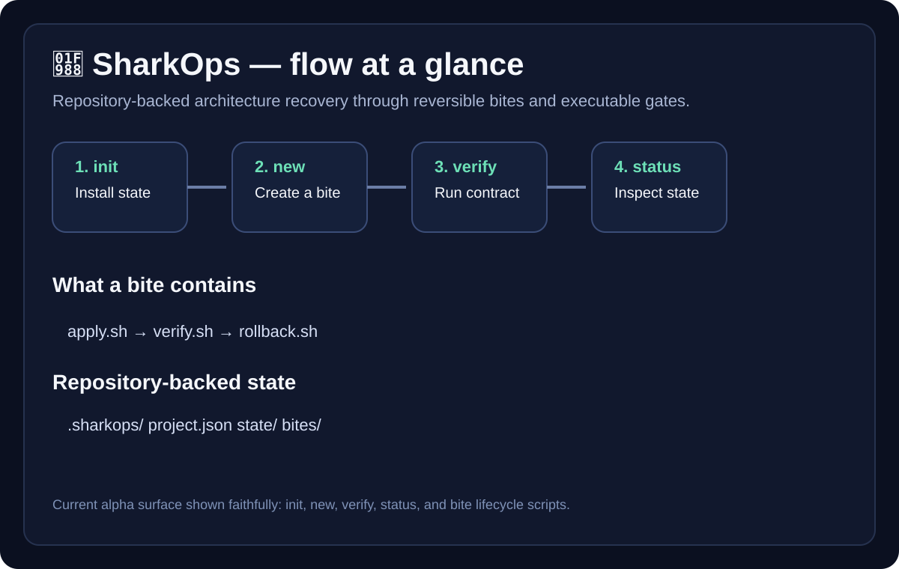
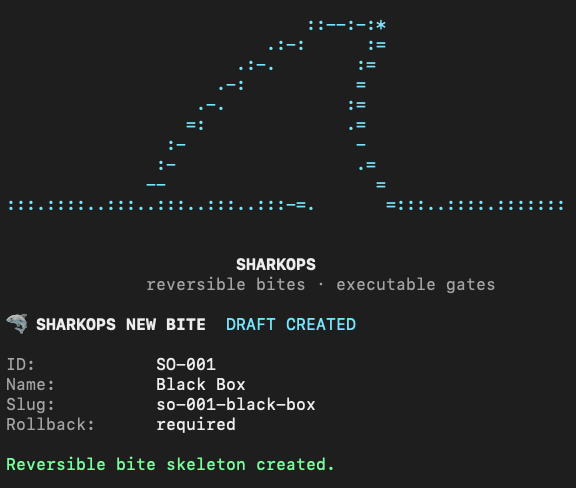

# 🦈 SharkOps

<p align="center">
  <strong>Architecture recovery and project governance CLI with repository-backed state, reversible bite scaffolding, structural verification and package portability.</strong>
</p>

<p align="center">
  Turn technical decisions into visible project state, controlled change packages and checks that actually run.
</p>

---

## What SharkOps is

SharkOps is a standalone Node.js CLI created from a real engineering workflow to make technical decisions more explicit, traceable and verifiable inside the repository.

The current release is **`0.1.0-alpha`**. Its scope is deliberately small: prove the CLI, repository-owned state model, reversible bite scaffolding, structural verification and portability before expanding the surface area.

## What works today

- standalone Node.js CLI;
- `init`, `status`, `doctor`, `verify` and `new`;
- repository-owned state under `.sharkops/`;
- bite ledger and current-state files;
- reversible bite scaffolding with `MANIFEST.json`, `apply.sh`, `verify.sh` and `rollback.sh`;
- structural verification of the installed SharkOps contract;
- package portability verification in a fresh external repository;
- CI on Node.js 20 and 22.

What is **not** implemented as a first-class CLI capability yet:

- `sharkops apply`;
- `sharkops rollback`;
- automatic execution of generated bite lifecycle scripts;
- dynamic loading and execution of rich project-specific architectural policies;
- automatic progression of project state based on bite execution.

Those are directions for evolution, not capabilities this alpha claims to ship.

## Why SharkOps exists

Architecture rarely breaks because a team has no rules.

It breaks because important decisions become scattered across chats, tickets, documentation and memory while the code keeps moving underneath them.

SharkOps approaches that problem by keeping operational state close to the code and making the recovery workflow explicit.

> **Reduce technical decision load so developers can focus on product.**

## Flow at a glance

<p align="center">
  
</p>

The conceptual workflow is:

```text
IDENTIFY
   ↓
DECIDE
   ↓
ATTACK
   ↓
VERIFY
   ↓
REGISTER
   ↓
ROLLBACK
```

This is the **operating model**, not a one-to-one list of CLI commands.

Today, `sharkops new` creates a bite skeleton with:

```text
MANIFEST.json
apply.sh
verify.sh
rollback.sh
payload/
reports/
```

The lifecycle scripts are project-owned scaffolds. SharkOps creates them, marks the bite as reversible and records it in the ledger, but does not yet expose `apply` or `rollback` as first-class CLI commands or automatically execute those scripts.

## Quick start

**Requirement:** Node.js 20 or newer.

Install the current alpha directly from GitHub:

```bash
npm install --save-dev github:tialaR/sharkops
```

Initialize SharkOps:

```bash
npx sharkops init
```

Inspect the current state and installation:

```bash
npx sharkops status
npx sharkops doctor
npx sharkops verify
```

Create a reversible bite skeleton:

```bash
npx sharkops new SO-001 "Black Box"
```

## CLI

<p align="center">
  
</p>

<p align="center">
  
</p>

### `init`

Creates the `.sharkops/` project structure, initial state and empty bite ledger without modifying existing project contracts.

### `status`

Reads and displays the current recorded SharkOps state from `.sharkops/state/current-state.json`.

### `doctor`

Checks whether the expected SharkOps files and structure are present. Inside the SharkOps engine repository, it also checks the engine's own command and core files.

### `verify`

Verifies the installed SharkOps structural contract: required files, package bin wiring, project engine identity and bite-ledger shape.

It does **not** yet behave as a general-purpose project architecture rule engine.

### `new`

Creates a reversible bite skeleton, records it in the bite ledger and generates `apply.sh`, `verify.sh` and `rollback.sh` placeholders ready for project-specific implementation.

## Architecture

SharkOps deliberately separates reusable tooling from the architecture of the repository using it.

```text
SharkOps engine
      │
      ├── CLI
      ├── generic commands
      └── structural verification
             │
             ▼
Host repository
      │
      └── .sharkops/
            ├── project state
            ├── bite ledger
            ├── reversible bite scaffolds
            └── future/project-owned contracts
```

The engine does not need to understand the application's internal architecture.

The host project remains the owner of its own rules.

This boundary keeps SharkOps portable while leaving room for each repository to grow stronger project-specific contracts without coupling them to the engine.

**[Architecture →](./docs/ARCHITECTURE.md)**

## Portability and CI

The repository includes a package-level smoke test:

```bash
npm run test:smoke
```

It packages SharkOps, installs it into a fresh temporary repository and exercises:

```text
package
   ↓
external repository
   ↓
init
   ↓
status
   ↓
doctor
   ↓
verify
```

Expected verdict:

```text
VERDICT: PORTABILITY VERIFIED
```

GitHub Actions runs structural verification and the portability smoke test on **Node.js 20 and 22** for pushes and pull requests to `main`.

## Architecture decisions

The repository keeps architectural decisions close to the implementation instead of leaving their rationale implicit.

- [ADR 0001 — Engine / host-project boundary](./docs/architecture/adr/0001-engine-host-boundary.md)
- [ADR 0002 — Reversible bites](./docs/architecture/adr/0002-reversible-bites.md)

See also:

- [Architecture](./docs/ARCHITECTURE.md)
- [SharkOps workflow](./docs/sharkops/SHARKOPS.md)

## What this repository demonstrates

For an engineering reviewer, SharkOps demonstrates:

- a real standalone CLI with five implemented commands;
- repository-backed operational state;
- reversible change scaffolding with an explicit recovery path;
- separation between reusable tooling and host-project state;
- executable structural verification;
- package portability verified outside the source repository;
- CI across multiple Node.js versions;
- architecture decisions documented with rationale and trade-offs.

It does **not** claim that the current alpha automates the full lifecycle of architectural change.

## Where it came from

SharkOps emerged while hardening **TDM Construtor**, a production-style frontend product where architectural recovery required controlled refactors, regression protection, explicit state and repeatable verification.

The standalone repository extracts the reusable mechanism without carrying TDM's project-specific history or architecture into the package.

```text
real project pressure
        ↓
working engineering practice
        ↓
generic extraction
        ↓
SharkOps
```

## Philosophy

- **No silent deviation.**
- Important architectural decisions should not live only in memory or conversation history.
- Rules worth protecting should move toward executable contracts when practical.
- Recovery should be designed alongside risky change.
- Project-specific rules belong to the host repository.
- Tooling should reduce human decision load, not create another job.
- Architecture governance should help product development move with more confidence, not less.

## Repository structure

```text
bin/                         CLI entrypoint
src/commands/                command implementations
src/core/                    shared engine primitives
.sharkops/                   SharkOps state for this repository
scripts/                     package verification
docs/                        architecture and workflow documentation
.github/workflows/           continuous verification
```

## License

MIT

---

<p align="center">
  <strong>🦈 SharkOps</strong><br />
  Reversible bites · repository-backed state · structural verification
</p>

<p align="center">
  Created by <strong>Tiala Rocha</strong>
</p>
