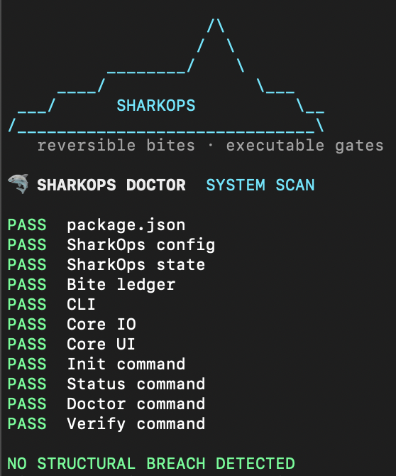

# 🦈 SharkOps

<p align="center">
  <strong>Architecture recovery and project governance through reversible bites and executable gates.</strong>
</p>

<p align="center">
  Turn architectural decisions into repository-backed state, controlled change packages and verification that actually runs.
</p>

---

## Why SharkOps exists

Architecture rarely breaks because a team has no rules.

It breaks because important decisions gradually become scattered across chats, tickets, documentation and memory, while refactors continue moving underneath them.

SharkOps approaches that problem differently:

```text
decision
   ↓
repository-backed state
   ↓
reversible bite
   ↓
executable verification
   ↓
registered result
````

The goal is simple:

> **Reduce technical decision load so developers can focus on product.**

SharkOps is intentionally opinionated. Important architectural decisions should become inspectable, reproducible and, when worth protecting, executable.

## The workflow

```text
IDENTIFY
   ↓
DECIDE
   ↓
ATTACK
   ↓
VERIFY
   ↓
REGISTER
   ↓
ROLLBACK
```

Instead of treating architectural recovery as a sequence of irreversible edits, SharkOps organizes controlled changes into **bites**.

A bite starts with three explicit lifecycle operations:

```text
apply
verify
rollback
```

That makes the change itself, its validation and its recovery path part of the same unit of work.

## CLI

<p align="center">
  
</p>

```bash
sharkops init
sharkops status
sharkops doctor
sharkops verify
sharkops new
```

### `init`

Installs SharkOps state into an existing repository.

### `status`

Shows the current operational state, including the latest and next planned bite.

### `doctor`

Checks whether the SharkOps installation and engine structure are healthy.

### `verify`

Runs the installed contract and reports architectural or structural breaches.

### `new`

Creates a new reversible bite with its lifecycle already explicit.

## Quick start

**Requirement:** Node.js 20 or newer.

The current alpha can be installed directly from GitHub:

```bash
npm install --save-dev github:tialaR/sharkops
```

Initialize it inside a repository:

```bash
npx sharkops init
```

Inspect the state:

```bash
npx sharkops status
npx sharkops doctor
npx sharkops verify
```

Create a bite:

```bash
npx sharkops new SO-001 "Black Box"
```

SharkOps creates project-owned state similar to:

```text
.sharkops/
├── project.json
├── state/
│   ├── current-state.json
│   └── bite-ledger.json
└── bites/
    └── so-001-black-box/
        ├── MANIFEST.json
        ├── apply.sh
        ├── verify.sh
        ├── rollback.sh
        ├── payload/
        └── reports/
```

## Engine and host project stay separate

SharkOps deliberately separates reusable tooling from the architecture of the repository using it.

```text
SharkOps engine
      │
      ├── CLI
      ├── generic commands
      └── verification infrastructure
             │
             ▼
Host repository
      │
      └── .sharkops/
            ├── project state
            ├── bite ledger
            ├── reversible bites
            └── project-specific contracts
```

The engine does not need to understand the application's internal architecture.

The host project remains the owner of its own rules.

This boundary keeps SharkOps portable while allowing each repository to turn its particular architectural decisions into enforceable contracts.

**[Architecture →](./docs/ARCHITECTURE.md)**

## Executable governance

SharkOps treats repository state as part of engineering governance.

The intent is not to accumulate checks.

It is to close the gap between:

```text
"We decided this."
```

and:

```text
"The repository can prove whether this is still true."
```

That can include structural boundaries, migration rules, ownership constraints, forbidden dependencies or any other project decision that can be verified deterministically.

> **No silent deviation. Every approved rule becomes a gate.**

## Portability is tested

The repository includes a package-level smoke test:

```bash
npm run test:smoke
```

The test packages SharkOps, installs it into a fresh external repository and exercises the standalone workflow:

```text
package
   ↓
external repository
   ↓
init
   ↓
status
   ↓
doctor
   ↓
verify
```

Expected verdict:

```text
VERDICT: PORTABILITY VERIFIED
```

GitHub Actions executes the engine contract and portability verification on **Node.js 20 and 22** for pushes and pull requests to `main`.

## Architecture decisions

The repository keeps architectural decisions close to the implementation rather than leaving their rationale implicit.

* [ADR 0001 — Engine / host-project boundary](./docs/architecture/adr/0001-engine-host-boundary.md)
* [ADR 0002 — Reversible bites](./docs/architecture/adr/0002-reversible-bites.md)

See also:

* [Architecture](./docs/ARCHITECTURE.md)
* [SharkOps workflow](./docs/sharkops/SHARKOPS.md)

## Philosophy

* **No silent deviation.**
* Important architectural decisions should not live only in memory or conversation history.
* Validated rules should become executable contracts when practical.
* Recovery should be designed alongside risky change.
* Project-specific rules belong to the host repository.
* Tooling should reduce human decision load, not create another job.
* Architecture governance should help product development move with more confidence, not less.

## Where it came from

SharkOps was not designed as an abstract architecture exercise.

It emerged while hardening **TDM Construtor**, a production-style frontend product where architectural recovery required controlled refactors, regression protection, explicit state and repeatable verification.

The workflow evolved there through real engineering constraints.

This standalone repository extracts the reusable mechanism without carrying TDM's project-specific history or architecture into the package.

That distinction is intentional:

```text
real project pressure
        ↓
working engineering practice
        ↓
generic extraction
        ↓
SharkOps
```

## Current status

**`0.1.0-alpha`**

Standalone core:

* `init`
* `status`
* `doctor`
* `verify`
* `new`
* repository-backed state
* reversible bite scaffolding
* executable engine verification
* external package portability smoke test
* CI on Node.js 20 and 22

The alpha scope is deliberately small: prove the governance model and package boundary before expanding the surface area.

## Repository structure

```text
bin/                         CLI entrypoint
src/commands/                command implementations
src/core/                    shared engine primitives
.sharkops/                   SharkOps state for this repository
scripts/                     package verification
docs/                        architecture and workflow documentation
.github/workflows/           continuous verification
```

## License

MIT

---

<p align="center">
  <strong>🦈 SharkOps</strong><br />
  Reversible bites · executable gates · no silent deviation
</p>

<p align="center">
  Created by <strong>Tiala Rocha</strong>
</p>
